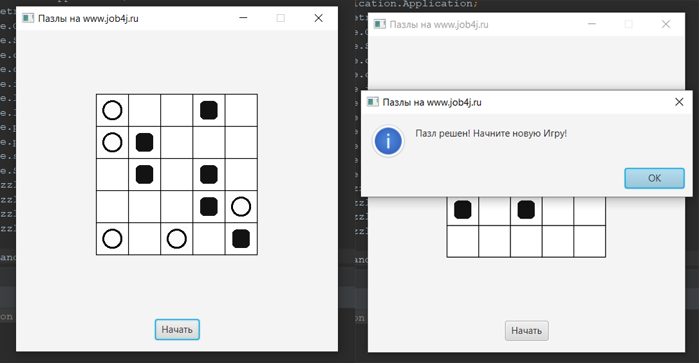
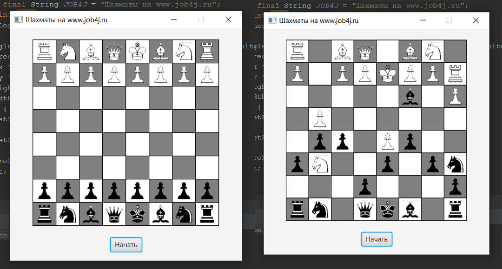
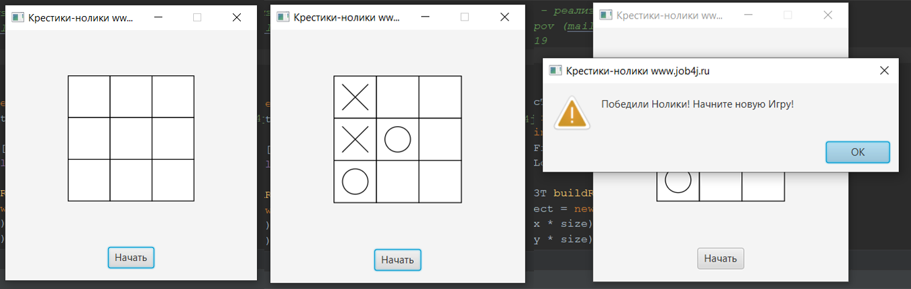

# Учебный курс по Java (Ильи Осипова)

В данном репозитории выполненые задания по курсу [Job4j](https://job4j.ru/). На данный момент это лучшие курсы 
в Рунете по Java.

Краткое содержание:
* [chapter_001](https://github.com/ilyaosipov3425/job4j/tree/master/chapter_001) - Базовый Синтексис (Типы данных, Условные операторы, Циклы, Массивы). Игра Пазлы.
* [chapter_002](https://github.com/ilyaosipov3425/job4j/tree/master/chapter_002) - ООП (Наследование, Инкапсуляция, Полиморфизм). Программа Трекер. Игра Шахматы.
* [chapter_003](https://github.com/ilyaosipov3425/job4j/tree/master/chapter_003) - Collection (Обобщение, Сортировка, Инструменты).
* [chapter_004](https://github.com/ilyaosipov3425/job4j/tree/master/chapter_004) - Lambda, Steam API (Lambda, Stream API, JDK 1.9, 1.10). Игра Крестики-Нолики.

Предрварительный просмотр
--------------------------
Пазлы

Шахматы

Крестики-Нолики

Контакты
---------
e-mail: il.osipov.ya@yandex.ru \ telegram: [@il_osipov](https://t.me/il_osipov) \ tel: +7 911 395 34 25